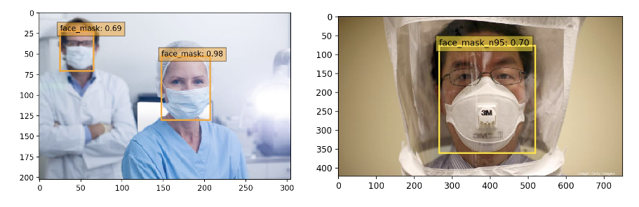

# Face Mask & N95 Mask Detector
This project implements an SSD network to detect human faces, faces with regular clinical masks, and faces with N95 masks. 

The poster presentation can be accessed at [Poster Session](https://github.com/AriaWangXH/clinical-N95-face-mask-detection/blob/master/deliverables/mask_on_poster.pdf)

Feel free to check out our [presentation video](https://www.youtube.com/watch?v=JJTm-KA-wvw&feature=youtu.be)!

Prediction Example


To try it using your own images:
- Create a folder called "my_img" from the source directory
- Put the image inside my_img/, and run the following command from the root folder:
```
python demo.py
```
